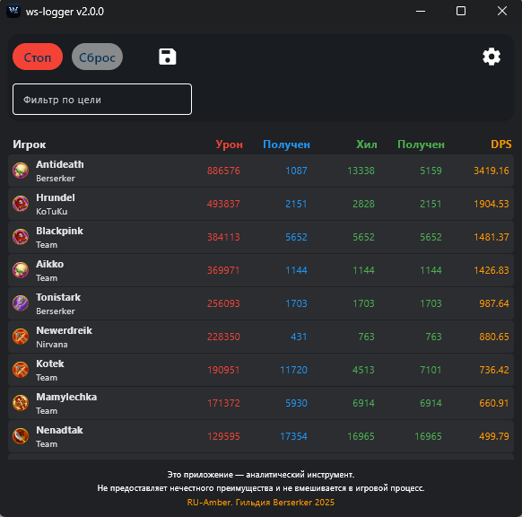

  

<strong>ws-logger </strong>

Приложение для отслеживания боевой статистики в игре Warspear Online. Оно автоматически определяет нанесенный урон и исцеление игроков, отображая данные в виде таблицы.

## Возможности
- Отслеживание статистики урона и исцеления в реальном времени.
- Детальные метрики по нанесенному урону, полученному урону, исцелению, полученному исцелению и самоисцелению.
- Корректное присвоение урона и исцеления от питомцев их владельцам.
- Возможность сортировки данных по любому столбцу.
- Фильтрация статистики по конкретной цели.
- Двойной клик по игроку для просмотра детальной статистики его урона по целям.
- Экспорт результатов в виде таблицы Excel.
- Управление настройками сервера, сетевого интерфейса и версии клиента внутри приложения.

## Требования
- Windows 10/11
- Npcap
- Активный игровой клиент Warspear Online 13.0.1
- Права администратора (для доступа к сетевым интерфейсам)

## Установка
1.  **Скачайте последнюю версию** со [страницы релизов](https://github.com/shttl/ws-logger/releases).
2.  **Установите библиотеку Npcap:**
    - Скачайте Npcap с [официального сайта](https://npcap.com/#download).
    - Во время установки убедитесь, что выбрали опцию:
        - `Install Npcap in WinPcap API-compatible Mode`
3.  Распакуйте архив с программой в удобное для вас место.

## Использование
1.  Запустите игру и войдите в своего персонажа.
2.  Запустите `ws-logger_1.1.1.exe` с правами администратора.
3.  Используйте кнопки **"Старт"** и **"Стоп"** для управления сбором статистики.
4.  Участвуйте в PvP/PvE активностях — статистика будет собираться автоматически, когда сбор активен.

  

## Конфигурация
Все настройки управляются через кнопку **"Настройки"** в интерфейсе приложения. Файл `config.ini` создается автоматически и будет обновляться из графического интерфейса.

Доступны следующие настройки:
- **Выберите сервер:** Выберите игровой сервер, на котором вы играете.
- **Сетевой интерфейс:** Выберите сетевой интерфейс, который ваш компьютер использует для доступа в интернет. Если вы не уверены, правильное имя можно найти, выполнив команду `ipconfig` в командной строке.
- **Версия клиента:** Укажите версию игрового клиента, которую вы используете (`Обычная` или `Steam`).

Изменения настроек могут потребовать перезапуска приложения для вступления в силу.

## Решение проблем
1.  **Программа не видит никаких событий:**
    - Убедитесь, что вы запустили программу с правами администратора.
    - Проверьте, что в настройках выбран правильный сетевой интерфейс.
    - Убедитесь, что правильно выбран ваш игровой сервер.
2.  **Антивирус блокирует приложение:**
    - Добавьте папку с программой в список исключений вашего антивируса.
    - Разрешите приложению доступ к сети в настройках вашего брандмауэра.

## Важно!
**Данный инструмент предназначен исключительно для сбора и анализа статистики. Он не предоставляет нечестного преимущества и не вмешивается в игровой процесс. Вся ответственность за использование программы лежит на вас.**