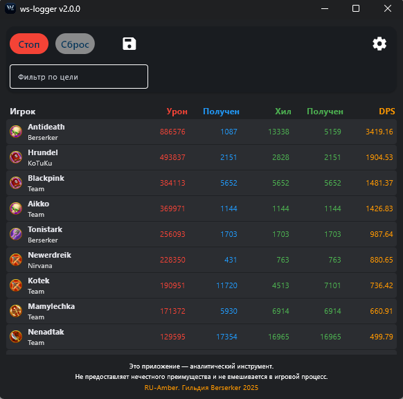
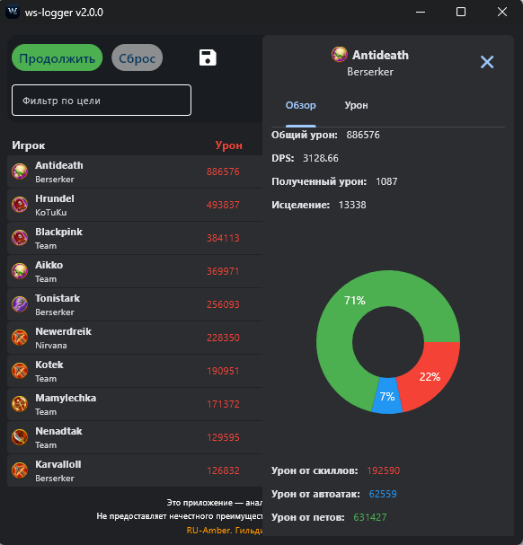

  

<strong>ws-logger </strong>

Приложение для отслеживания боевой статистики в игре Warspear Online. Оно автоматически определяет нанесенный урон и исцеление игроков, отображая данные в виде таблицы.

## Возможности
- Отслеживание статистики урона и исцеления в реальном времени.
- Детальные метрики по нанесенному урону, полученному урону, исцелению, полученному исцелению и самоисцелению.
- Корректное присвоение урона и исцеления от питомцев их владельцам.
- Возможность сортировки данных по любому столбцу.
- Фильтрация статистики по конкретной цели.
- Клик по игроку для просмотра детальной статистики его урона по целям.
- Экспорт результатов в виде таблицы Excel или SQLite (.db).
- Автоматическое определение входа в рейд и автоматический экспорт статистики (включается в настройках).
- Управление настройками сервера, сетевого интерфейса и версии клиента внутри приложения.

## Требования
- **ОС**: Windows 10/11 (x64)
- **Драйвер Npcap**: Необходим для захвата сетевого трафика.
- **Версия игры**: Warspear Online 13.3.x (поддерживаются как Обычная, так и Steam версии).
- **Права администратора**: Требуются для доступа к сетевым интерфейсам.

## Установка
1.  **Скачайте последнюю версию** со [страницы релизов](https://github.com/shttl/ws-logger/releases).
2.  **Установите Npcap:**
    - Скачайте Npcap с [официального сайта](https://npcap.com/).
    - Во время установки убедитесь, что выбрали опцию:
        - `Install Npcap in WinPcap API-compatible Mode`
3.  Распакуйте архив с программой в удобное для вас место.

## Использование
1. Запустите игру и войдите в своего персонажа.
2. Запустите `ws-logger.exe` от имени администратора.
3. В **Настройках** выберите правильный сетевой интерфейс и игровой сервер.
4. Там же выберите предпочтительный формат экспорта (Excel или SQLite).
5. Нажмите кнопку **"Начать"** для запуска сбора статистики.
6. Приложение автоматически начнет отслеживать события. По завершении боя или рейда используйте кнопку **"Стоп"** или дождитесь автоматического сохранения (для рейдов).

  

  

## Конфигурация
Все настройки управляются через кнопку **"Настройки"** в интерфейсе приложения. Файл `user_settings.json` создается автоматически и будет обновляться из графического интерфейса.

Доступны следующие настройки:
- **Сетевой интерфейс:** Выберите сетевой интерфейс, который ваш компьютер использует для доступа в интернет. Если вы не уверены, правильное имя можно найти, выполнив команду `ipconfig` в командной строке.
- **Игровой сервер:** Выберите игровой сервер, на котором вы играете.
- **Игровой клиент:** Укажите версию игрового клиента, которую вы используете (`Обычная` или `Steam`).
- **Формат экспорта:** Выберите формат сохранения таблицы статистики (`Excel` или `SQLite`).
- **Автозапись рейдов** Включите или выключите автоматическое обнаружение и запись статистики рейдов.

## Решение проблем
1.  **Программа не видит никаких событий:**
    - Убедитесь, что вы запустили программу с правами администратора.
    - Повтороно выберете в настройках правильный сетевой интерфейс.
    - Убедитесь, что правильно выбран ваш игровой сервер.
    - Перезапустите программу, предварительно войдите в своего игрового персонажа.
2.  **Антивирус блокирует приложение:**
    - Добавьте папку с программой в список исключений вашего антивируса.
    - Разрешите приложению доступ к сети в настройках вашего брандмауэра.

## Важно!
**Данный инструмент предназначен исключительно для сбора и анализа статистики. Он не предоставляет нечестного преимущества и не вмешивается в игровой процесс. Вся ответственность за использование программы лежит на вас.**